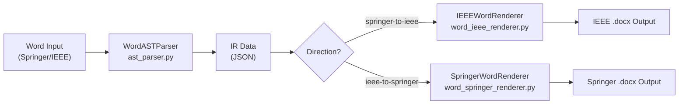
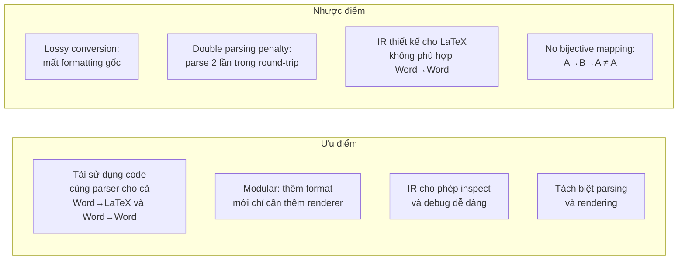

# Phân Tích Bài Toán Chuyển Đổi Word ↔ Word (Springer ↔ IEEE)

## 1. Tổng Quan Pipeline

Dự án có 2 bài toán chính:
- **Bài toán 1**: Word → LaTeX (ổn định ✅)
- **Bài toán 2**: Word → Word (Springer ↔ IEEE) (đang có vấn đề ⚠️)

### Luồng dữ liệu Word-to-Word



### Tình trạng hiện tại

| Hướng chuyển đổi | Trạng thái | Ghi chú |
|---|---|---|
| Springer Word → IEEE Word | ✅ Thành công | Output đúng format IEEE |
| IEEE Word → Springer Word | ❌ **Nhiễu, mất format** | Lỗi nghiêm trọng |
| IEEE Word (vừa tạo) → Springer Word | ❌ **Lỗi tồi tệ nhất** | Format hỏng hoàn toàn |

---

## 2. Nguyên Nhân Gốc (Root Causes)

Sau khi phân tích toàn bộ source code, tôi xác định **12 nguyên nhân chính** gây lỗi khi chuyển IEEE Word → Springer Word:

### 🔴 Nhóm A: Vấn đề ở WordASTParser (Parsing sai)

#### A1. State Machine được hiệu chỉnh thiên lệch cho Springer
- File [ast_parser.py](file:///c:/221761_TIEN_PHONG_TT_VL_2026/backend/core_engine/ast_parser.py#L515-L872) có state machine `_build_semantic_tree()` được thiết kế chủ yếu cho cấu trúc Springer
- IEEE document có cấu trúc rất khác: Title → Authors (trong table invisible) → Abstract (inline với "Abstract—") → Index Terms → Body (2-column)
- Khi parse file IEEE, parser thường **không nhận ra đúng các section metadata** do format IEEE khác biệt

#### A2. Heading Detection Mismatch
- IEEE dùng heading style: `"I. INTRODUCTION"`, `"A. Subsection"` (Roman numerals + ALL CAPS)  
- Springer dùng: `"1 Introduction"`, `"1.1 Subsection"` (Arabic numbers)
- `HEADING_PATTERNS` trong [config.py](file:///c:/221761_TIEN_PHONG_TT_VL_2026/backend/core_engine/config.py#L95-L103) không có pattern cho IEEE-style Roman numeral headings
- Khi parse IEEE output, nhiều heading bị phân loại sai thành paragraph thường

#### A3. Author Block Parse Failure cho IEEE Format
- IEEE Word output dùng **invisible-bordered table** cho author block (line 776-856 trong [word_ieee_renderer.py](file:///c:/221761_TIEN_PHONG_TT_VL_2026/backend/core_engine/word_ieee_renderer.py#L776-L856))
- Mỗi author block là 1 cell với name + affiliations nối bằng `WD_BREAK.LINE`
- `_build_semantic_tree()` xử lý table trước abstract ([line 762-785](file:///c:/221761_TIEN_PHONG_TT_VL_2026/backend/core_engine/ast_parser.py#L762-L785)) nhưng logic quá đơn giản, dễ bỏ qua hoặc parse sai

#### A4. Abstract Extraction Failure
- IEEE format: `"Abstract—This paper presents..."` (dùng em-dash —)  
- Springer format: `"Abstract. This paper presents..."` (dùng dấu chấm)
- Parser dùng regex `re.sub(r"^(abstract\.?)[:\s]*"...` cho abstract cleanup nhưng **không handle IEEE em-dash format khi parsing ngược**
- Kết quả: abstract bị mất hoặc bị trộn với keywords

#### A5. Keywords/Index Terms Confusion
- IEEE gọi là `"Index Terms—keyword1, keyword2..."` 
- Springer gọi là `"Keywords: keyword1, keyword2..."`
- Parser có xử lý cả hai nhưng khi IEEE output được generate bởi renderer, format `"Keywords—"` hoặc `"Index Terms—"` không khớp hoàn toàn với regex của parser

### 🟡 Nhóm B: Vấn đề ở IR (Intermediate Representation)

#### B1. Lossy Conversion — Mất thông tin format gốc
- IR chỉ lưu text dạng LaTeX-like (`\textbf{...}`, `\textit{...}`) → **mất hoàn toàn style Word gốc**
- Table cell formatting (alignment, border, width) → chỉ lưu text content
- Paragraph style name → không được lưu trong IR
- Font size, spacing, indentation → **hoàn toàn bị mất**

#### B2. Citation Round-trip Corruption
- `_post_process_citations()` ([line 945-979](file:///c:/221761_TIEN_PHONG_TT_VL_2026/backend/core_engine/ast_parser.py#L945-L979)) chuyển `[1]` → `\cite{ref1}`
- Khi render, `\cite{ref1}` → `[1]` 
- Nhưng khi parse lại file output, `[1]` lại bị chuyển thành `\cite{ref1}` → số reference có thể bị lệch do re-indexing

#### B3. OMML Base64 Bloating
- Công thức được encode thành `«OMML:base64...»` marker trong IR
- Khi IEEE renderer output OMML native vào Word file, parser phải đọc lại OMML từ Word file mới
- Quá trình encode/decode OMML qua base64 **có thể mất namespace hoặc bị corrupt**

### 🔵 Nhóm C: Vấn đề ở SpringerWordRenderer

#### C1. Kế thừa IEEEWordRenderer — Tight Coupling
- `SpringerWordRenderer` **kế thừa trực tiếp** từ `IEEEWordRenderer` ([line 17](file:///c:/221761_TIEN_PHONG_TT_VL_2026/backend/core_engine/word_springer_renderer.py#L17))
- Override một số method nhưng **phần lớn logic vẫn dùng IEEE logic**
- Ví dụ: `render()` gọi `super().render()` → dùng `_rebuild_on_uploaded_template()` → xóa sạch body template → xây lại → **xóa mất layout Springer template gốc**

#### C2. Template Body Clearing Strategy  
- `_clear_document_body_preserve_layout()` ([line 182-196](file:///c:/221761_TIEN_PHONG_TT_VL_2026/backend/core_engine/word_ieee_renderer.py#L182-L196)) **xóa TOÀN BỘ nội dung** body, chỉ giữ `sectPr`
- Springer template `splnproc2510.docm` có header/footer, bookmarks, macro, field codes đặc biệt → **bị xóa hết**
- Kết quả: output mất hoàn toàn "hồn" của template Springer

#### C3. Style Name Mismatch
- `_pick_style_name()` tìm style theo tên nhưng Springer template có style names riêng: `"papertitle"`, `"heading1"`, `"heading2"`, `"author"`, `"address"`, `"abstract"`, `"keywords"`, `"p1a"`, `"referenceitem"`, `"figurecaption"`
- Khi document input là IEEE output (không có các style này), việc tìm style fallback có thể trả về style không phù hợp hoặc `None`

#### C4. Numbering Style Mismatch
- IEEE headings: Roman `"I. INTRODUCTION"` 
- Springer headings: Arabic `"1 Introduction"`
- `_strip_existing_heading_number()` trong SpringerWordRenderer ([line 608-614](file:///c:/221761_TIEN_PHONG_TT_VL_2026/backend/core_engine/word_springer_renderer.py#L608-L614)) strip IEEE Roman numbers nhưng regex có thể không bắt hết các trường hợp

---

## 3. Hai Mươi (20) Giải Pháp Khắc Phục

### 📋 Nhóm 1: Cải thiện WordASTParser (Parser)

#### 1. Thêm IEEE-specific Heading Patterns
Thêm regex cho IEEE-style headings vào `HEADING_PATTERNS` trong `config.py`:
```python
# IEEE Roman numeral headings
(r'^[IVX]+\.\s+[A-Z][A-Z\s]+$', r'\section'),     # I. INTRODUCTION
(r'^[A-Z]\.\s+.+$', r'\subsection'),               # A. Related Work  
(r'^\d+\)\s+.+$', r'\subsubsection'),              # 1) Sub-subsection
```

#### 2. Dual-mode State Machine
Thêm auto-detect source format trước khi parse:
```python
def _detect_source_format(self) -> str:
    """Detect if input is IEEE, Springer, or generic Word."""
    for p in self.doc.paragraphs[:20]:
        style = (p.style.name or "").lower()
        if "paper title" in style or "papertitle" in style:
            if any(s.name == "Author" for s in self.doc.styles):
                return "ieee"
        if style in ("heading1", "heading2", "author", "address"):
            return "springer"
    return "generic"
```

#### 3. Cải thiện Author Table Detection
Nhận diện invisible-bordered table IEEE author block:
```python
def _is_ieee_author_table(self, table) -> bool:
    """Detect IEEE invisible-border author table."""
    tbl_pr = table._tbl.tblPr
    borders = tbl_pr.find(qn("w:tblBorders")) if tbl_pr else None
    if borders is None:
        return False
    all_nil = all(
        (borders.find(qn(f"w:{b}")) is not None and 
         borders.find(qn(f"w:{b}")).get(qn("w:val")) == "nil")
        for b in ["top", "left", "bottom", "right"]
    )
    return all_nil and len(table.rows) <= 3
```

#### 4. Fix Abstract Em-dash Parsing
Thêm xử lý IEEE abstract format:
```python
# Trong _build_semantic_tree, state == "abstract"
clean_text = re.sub(
    r"^(abstract\s*[—–\-\.:])\s*", "", text, flags=re.IGNORECASE
).strip()
```

#### 5. Cải thiện Keywords/Index Terms Detection
```python
def _is_keywords_label(self, text):
    norm = text.strip().upper()
    for kw in ["KEYWORDS", "INDEX TERMS", "TỪ KHÓA", "TU KHOA"]:
        if kw in norm:
            return True
    # Detect inline: "Index Terms—keyword1, keyword2"
    if re.match(r'^INDEX\s+TERMS\s*[—–\-:]\s*', norm):
        return True
    return False
```

### 📋 Nhóm 2: Cải thiện IR (Intermediate Representation)

#### 6. Lưu Source Format Metadata trong IR
```python
self.ir = {
    "source_format": "ieee",  # NEW: track source
    "metadata": {...},
    "body": [...],
    "references": [...]
}
```

#### 7. Lưu Original Style Names trong IR Body Nodes
```python
# Trong _parse_paragraph()
return {
    "type": "paragraph",
    "text": text,
    "has_math": has_math,
    "original_style": style_name,     # NEW
    "alignment": str(p.alignment),     # NEW
    "font_size_pt": max_font_size,     # NEW
}
```

#### 8. Lưu Table Structure Metadata
```python
# Trong _parse_table()
return {
    "type": "table",
    "data": parsed_rows,
    "caption": caption,
    "has_borders": not all_nil_borders,  # NEW
    "is_layout_table": is_layout_table,  # NEW: equation/author layout
    "col_widths_ratio": col_widths,      # NEW
}
```

#### 9. Preserving Section Break Information
```python
# Track section breaks giữa elements
section_breaks = []
for idx, (etype, element) in enumerate(elements):
    # Check if preceding XML has sectPr
    prev = element._p.getprevious() if etype == "paragraph" else None
    if prev is not None and prev.tag == qn("w:sectPr"):
        section_breaks.append(idx)
self.ir["section_breaks"] = section_breaks
```

#### 10. Disable Citation Round-trip
Thêm flag để bypass `_post_process_citations()` trong Word-to-Word mode:
```python
class WordASTParser:
    def __init__(self, ..., mode="latex"):
        self.mode = mode  # "latex" hoặc "word2word"
    
    def parse(self):
        ...
        if self.mode != "word2word":
            self._post_process_citations()
        return self.ir
```

### 📋 Nhóm 3: Cải thiện SpringerWordRenderer

#### 11. Tách SpringerWordRenderer khỏi IEEEWordRenderer
Tạo base class chung:
```python
class BaseWordRenderer:
    """Common rendering logic for all Word formats."""
    def render(self, ir_data, output_path, image_root_dir, template_path):
        ...

class IEEEWordRenderer(BaseWordRenderer):
    """IEEE-specific rendering."""
    ...

class SpringerWordRenderer(BaseWordRenderer):
    """Springer-specific rendering (independent from IEEE)."""
    ...
```

#### 12. Smart Template Preservation
Thay vì xóa sạch template body, chỉ thay thế placeholder text:
```python
def _fill_springer_template(self, doc, metadata, body_nodes, references):
    """Fill Springer template by replacing placeholders, not clearing body."""
    # Find and replace title placeholder
    for p in doc.paragraphs:
        if p.style.name == "papertitle":
            p.clear()
            p.add_run(metadata["title"])
            break
    # ... tương tự cho abstract, keywords, body
```

#### 13. Fix Heading Numbering Round-trip
```python
def _strip_existing_heading_number(self, text):
    clean = (text or "").strip()
    # Strip IEEE Roman: "I. ", "II. ", "III. ", etc.
    clean = re.sub(r"^\s*[IVXLCDM]+\.\s+", "", clean)
    # Strip IEEE Letter: "A. ", "B. ", etc.
    clean = re.sub(r"^\s*[A-Z]\.\s+", "", clean)
    # Strip Arabic: "1. ", "1.1 ", etc.
    clean = re.sub(r"^\s*\d+(?:\.\d+)*\.?\s+", "", clean)
    # Strip duplicated numbering
    clean = re.sub(r"^\s*(\d+(?:\.\d+)?)\s+\1\s+", "", clean)
    return clean.strip()
```

#### 14. Add IEEE-to-Springer Caption Converter 
```python
def _convert_ieee_caption_to_springer(self, caption, kind):
    """Convert IEEE caption style to Springer style."""
    if kind == "table":
        # "TABLE I" → "Table 1"
        caption = re.sub(
            r"^TABLE\s+([IVXLCDM]+)", 
            lambda m: f"Table {self._roman_to_int(m.group(1))}", 
            caption
        )
    elif kind == "figure":
        # "Fig. 1." → "Fig. 1."  (already compatible)
        pass
    return caption
```

#### 15. Fix Column Layout Transition
```python
def _start_two_column_body(self, doc):
    """Springer = single column. Don't add unnecessary section breaks."""
    # Simply ensure all sections are 1-column
    for sec in doc.sections:
        self._set_section_columns(sec, 1)
    # DO NOT add new continuous section break
```

### 📋 Nhóm 4: Kiến trúc & Chiến lược

#### 16. Implement Round-trip Test Suite
```python
def test_round_trip_springer_ieee_springer():
    """Verify S→I→S preserves content."""
    ir_original = WordASTParser("springer_input.docx").parse()
    
    # S → I
    IEEEWordRenderer().render(ir_original, "ieee_output.docx", ...)
    
    # I → S  
    ir_from_ieee = WordASTParser("ieee_output.docx").parse()
    SpringerWordRenderer().render(ir_from_ieee, "springer_output.docx", ...)
    
    # Verify
    ir_final = WordASTParser("springer_output.docx").parse()
    assert ir_original["metadata"]["title"] == ir_final["metadata"]["title"]
    assert len(ir_original["body"]) == len(ir_final["body"])
```

#### 17. IR Diff/Debug Tool
```python
def diff_ir(ir_a, ir_b) -> dict:
    """Compare two IR dicts and highlight differences."""
    diff = {}
    for key in ["title", "abstract", "keywords"]:
        a_val = ir_a["metadata"].get(key, "")
        b_val = ir_b["metadata"].get(key, "")
        if a_val != b_val:
            diff[key] = {"original": a_val[:100], "converted": b_val[:100]}
    diff["body_count"] = {
        "original": len(ir_a["body"]),
        "converted": len(ir_b["body"])
    }
    return diff
```

#### 18. Add Format Detection Header to Output
Khi renderer tạo output, thêm hidden property vào document để parser biết nguồn gốc:
```python
# In renderer, after saving
doc.core_properties.comments = "Generated by: IEEEWordRenderer v2"
```

#### 19. Implement Validation Layer
```python
class IRValidator:
    """Validate IR data before rendering."""
    def validate(self, ir_data, target_format):
        warnings = []
        if not ir_data["metadata"]["title"]:
            warnings.append("Missing title")
        if not ir_data["metadata"]["abstract"]:
            warnings.append("Missing abstract")
        if len(ir_data["body"]) == 0:
            warnings.append("Empty body")
        body_text = " ".join(n.get("text","") for n in ir_data["body"])
        if len(body_text) < 500:
            warnings.append(f"Body too short: {len(body_text)} chars")
        return warnings
```

#### 20. Direct XML Transformation (Bypass IR for Word→Word)
Thay vì đi qua IR (lossy), dùng XSLT hoặc direct XML manipulation:
```python
class DirectWordTransformer:
    """Transform Word XML directly without going through IR."""
    def transform(self, input_path, output_path, source_format, target_format):
        doc = Document(input_path)
        template = Document(target_template_path)
        
        # Map styles directly
        style_map = self._build_style_mapping(source_format, target_format)
        for p in doc.paragraphs:
            if p.style.name in style_map:
                p.style = template.styles[style_map[p.style.name]]
        
        # Preserve all content, only change formatting
        doc.save(output_path)
```

---

## 4. Ưu và Nhược Điểm của Chiến Lược Chuyển Đổi Hiện Tại

### Chiến lược hiện tại: **Parse → IR → Render**



### Bảng đánh giá chi tiết

| Tiêu chí | Ưu điểm | Nhược điểm |
|---|---|---|
| **Tái sử dụng code** | ✅ Cùng `WordASTParser` cho cả Word→LaTeX và Word→Word | ❌ Parser được optimize cho LaTeX output, không phải Word output |
| **Extensibility** | ✅ Thêm format mới (ACM, Elsevier...) chỉ cần thêm renderer | ❌ Mỗi renderer mới phải handle tất cả LaTeX artifacts trong IR |
| **Debugging** | ✅ IR là JSON, dễ inspect qua `ir_data_debug.json` | ❌ IR mất quá nhiều thông tin, debug reverse conversion rất khó |
| **Content fidelity** | ✅ Text content cơ bản được giữ | ❌ Rich formatting (bold, italic, font size, alignment, spacing) bị mất hoặc bị biến đổi |
| **Math formula** | ✅ OMML được capture và re-insert native | ⚠️ Base64 round-trip có thể corrupt namespace |
| **Images** | ✅ Images được extract, save, và re-insert | ⚠️ Image sizing/positioning bị thay đổi |
| **Tables** | ✅ Data và merge cells được capture | ❌ Border styles, column widths, cell padding bị mất |
| **Round-trip stability** | ❌ S→I→S ≠ S (không bijective) | ❌ Mỗi lần convert thêm noise vào document |
| **Template fidelity** | ⚠️ Template styles được sử dụng khi available | ❌ `_clear_document_body_preserve_layout()` xóa sạch nội dung gốc |
| **Performance** | ✅ Fast (pure Python, no external tools) | ❌ Bộ nhớ lớn khi lưu OMML base64 |
| **Bidirectional** | ❌ Chỉ tối ưu 1 chiều (S→I) | ❌ Chiều ngược (I→S) bị lỗi nghiêm trọng |

### So sánh chiến lược thay thế

| Chiến lược | Chất lượng round-trip | Độ phức tạp | Tốc độ |
|---|---|---|---|
| **[Hiện tại] Parse→IR→Render** | ⭐⭐ (2/5) | ⭐⭐⭐ (3/5) | ⭐⭐⭐⭐ (4/5) |
| **Direct XML Transform** | ⭐⭐⭐⭐ (4/5) | ⭐⭐⭐⭐ (4/5) | ⭐⭐⭐⭐⭐ (5/5) |
| **Style Mapping + Content Merge** | ⭐⭐⭐⭐⭐ (5/5) | ⭐⭐⭐⭐⭐ (5/5) | ⭐⭐⭐ (3/5) |
| **Hybrid (IR for content + Direct for format)** | ⭐⭐⭐⭐ (4/5) | ⭐⭐⭐ (3/5) | ⭐⭐⭐⭐ (4/5) |

---

## 5. Khuyến Nghị Ưu Tiên

> [!IMPORTANT]
> Nếu chỉ sửa **5 thay đổi quan trọng nhất** để IEEE→Springer hoạt động, hãy ưu tiên:

1. **Giải pháp #2**: Dual-mode state machine (detect IEEE vs Springer input)
2. **Giải pháp #11**: Tách `SpringerWordRenderer` khỏi `IEEEWordRenderer`
3. **Giải pháp #1**: Thêm IEEE heading patterns
4. **Giải pháp #10**: Disable citation round-trip trong word2word mode
5. **Giải pháp #3**: Cải thiện IEEE author table detection

> [!TIP]
> Về lâu dài, **Giải pháp #20** (Direct XML Transformation) là chiến lược tốt nhất cho Word→Word vì nó tránh hoàn toàn việc mất thông tin qua IR. Có thể giữ IR pipeline cho Word→LaTeX.
